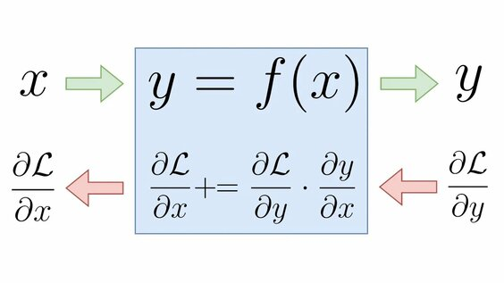

# Automatic differentiation visualization

## How to use

### Injection

You can use it both as a standalone application and as a part of your server. This is a one-page web app using only HTML5 &amp; JS.

- To be standalone app, you can use `./server-runner.py`,that provides a simple python server. It set the application to `localhost` on port `9000`. This server is just a proxy to your local files (you can not use the app without any server, because browsers restrict local file dependency &rarr; it means that you can not import one js file into another if they are not a server response)
- While as a single page to your existing server it can be added without any additional libraries or packages (npm, etc...). Everything is already imported by index.html itself as ``

### Compilation

- This application is written on TypeScript, but browsers allows only JS, so the whole code need to be compiled to JS (there is already compiled code in `./static/js`)
- The same thing is with SCSS which should be compiled to CSS before using
- Also, you should run to compile `nearley.js` grammar to TS code (and then to JS)
  > nearleyc ./parser/grammar.ne -o ./parser/grammar.ts

### Requirements

- Node.js
- Nearley.js

---

### Authors
- @AlexandrSinitsyn
- @Rabysh239
